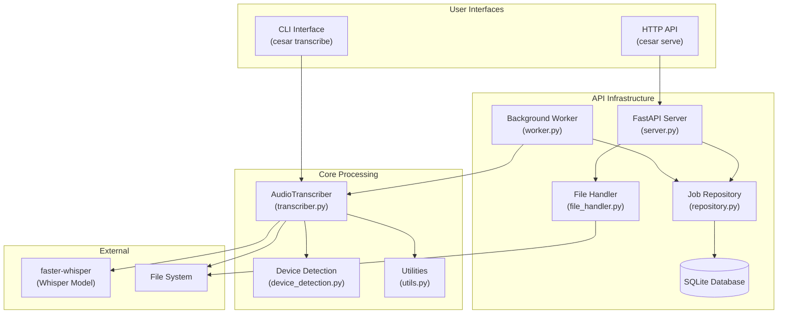
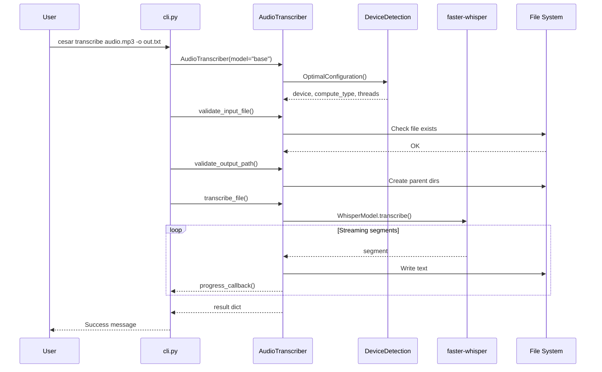
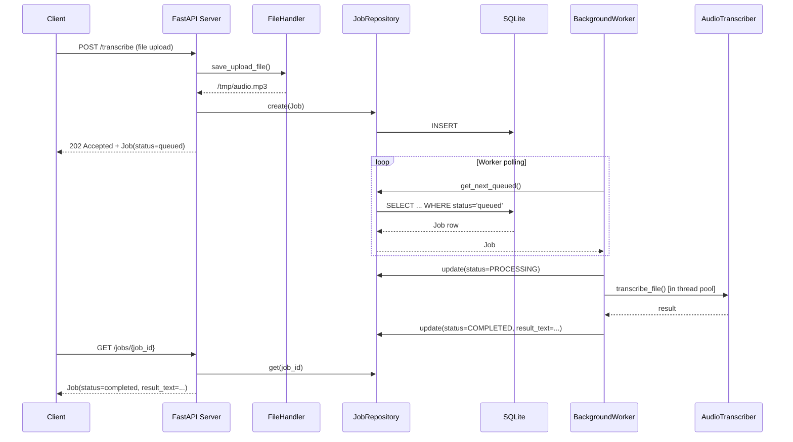
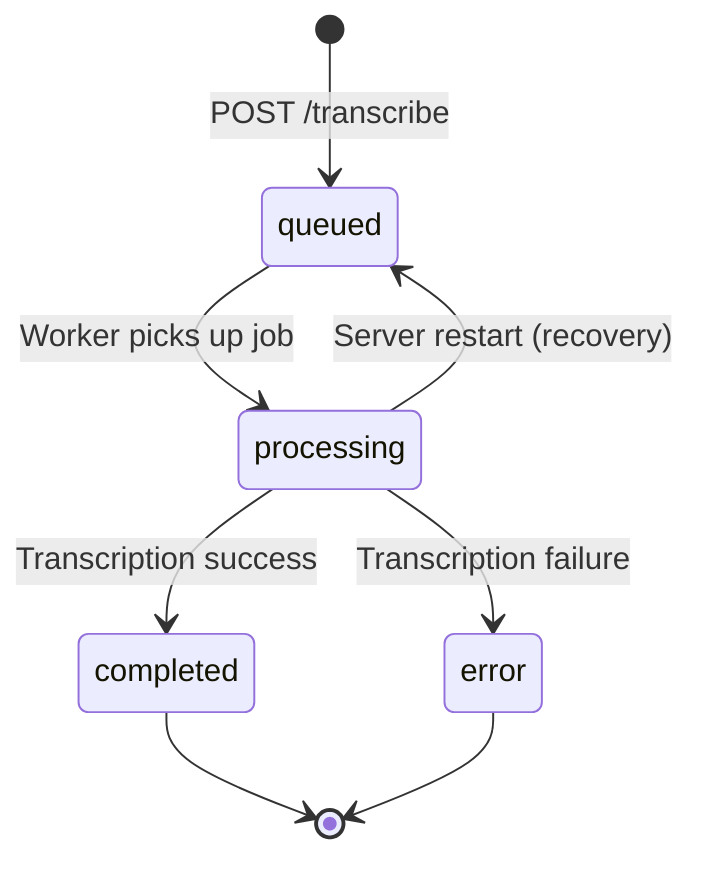
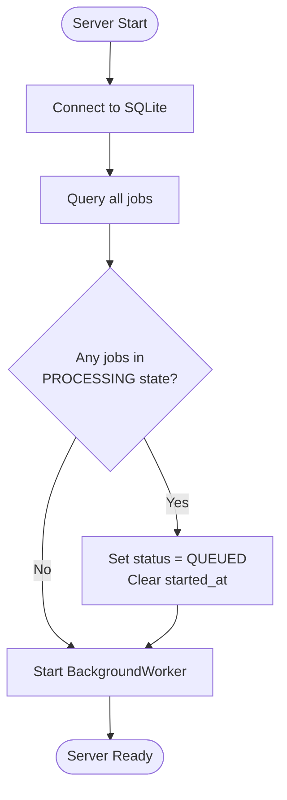

# Cesar Architecture Documentation

This document provides a comprehensive technical overview of the Cesar offline audio transcription system, covering both CLI and HTTP API interfaces.

## Table of Contents

- [System Overview](#system-overview)
- [High-Level Architecture](#high-level-architecture)
- [Directory Structure](#directory-structure)
- [Component Breakdown](#component-breakdown)
- [Data Flow Diagrams](#data-flow-diagrams)
- [Queue System Deep Dive](#queue-system-deep-dive)
- [Extension Points](#extension-points)
- [Debugging Guide](#debugging-guide)

---

## System Overview

Cesar is an offline audio transcription tool built on [faster-whisper](https://github.com/SYSTRAN/faster-whisper). It provides two interfaces:

| Interface | Purpose | Use Case |
|-----------|---------|----------|
| **CLI** (`cesar transcribe`) | Direct transcription | Single files, scripts, automation |
| **HTTP API** (`cesar serve`) | Async job queue | Web services, batch processing, integrations |

**Key characteristics:**
- **Offline-first**: No internet required after initial model download
- **Cross-platform**: Optimized for CPU, CUDA, and Apple Metal
- **Persistent queue**: SQLite-backed job queue with crash recovery
- **Async processing**: Non-blocking API with background worker

---

## High-Level Architecture



---

## Directory Structure

```
cesar/
├── __init__.py           # Package init, version management
├── __main__.py           # Entry point for `python -m cesar`
├── cli.py                # Click-based CLI commands (transcribe, serve)
├── transcriber.py        # Core AudioTranscriber class
├── device_detection.py   # Hardware detection (CUDA, MPS, CPU)
├── utils.py              # Formatting and validation helpers
└── api/                  # HTTP API module
    ├── __init__.py       # API exports
    ├── models.py         # Pydantic models (Job, JobStatus)
    ├── database.py       # SQLite schema definition
    ├── repository.py     # Async CRUD operations
    ├── server.py         # FastAPI app and endpoints
    ├── worker.py         # Background job processor
    └── file_handler.py   # File upload/download utilities
```

### Module Responsibilities

| Module | Responsibility |
|--------|----------------|
| `cli.py` | Command parsing, progress display, user interaction |
| `transcriber.py` | Model loading, audio validation, transcription execution |
| `device_detection.py` | Hardware capability detection, optimal config selection |
| `utils.py` | Time formatting, validation helpers, estimation |
| `api/models.py` | Job data model and status enum |
| `api/database.py` | Schema definition and initialization |
| `api/repository.py` | Database CRUD operations |
| `api/server.py` | HTTP endpoints and lifespan management |
| `api/worker.py` | Background job processing loop |
| `api/file_handler.py` | File upload validation and URL downloads |

---

## Component Breakdown

### 1. CLI Interface (`cli.py`)

The CLI uses [Click](https://click.palletsprojects.com/) for argument parsing and [Rich](https://rich.readthedocs.io/) for formatted output.

**Commands:**
- `cesar transcribe <file> -o <output>` - Transcribe audio file
- `cesar serve --port 5000` - Start HTTP API server

**Key classes:**
- `ProgressTracker` - Rich-based progress bar context manager

### 2. AudioTranscriber (`transcriber.py`)

Core transcription logic encapsulated in a single class.

```python
class AudioTranscriber:
    SUPPORTED_FORMATS = {'.mp3', '.wav', '.m4a', '.ogg', '.flac', '.aac', '.wma'}

    def __init__(model_size, device, compute_type, batch_size, num_workers)
    def validate_input_file(file_path) -> Path
    def validate_output_path(output_path) -> Path
    def get_audio_duration(file_path) -> float
    def transcribe_file(input_path, output_path, progress_callback, ...) -> Dict
    def get_model_info() -> Dict
```

**Lazy model loading**: Model is loaded on first transcription, not at init.

### 3. Device Detection (`device_detection.py`)

Automatic hardware detection and optimization.

```python
@dataclass
class DeviceCapabilities:
    has_cuda: bool
    has_mps: bool
    cuda_version: Optional[str]
    gpu_memory: Optional[int]
    cpu_cores: int
    optimal_threads: int
```

**Device priority**: CUDA > MPS > CPU

**Compute type selection:**
| Device | Compute Type |
|--------|--------------|
| CUDA (4GB+ VRAM) | float16 |
| CUDA (<4GB VRAM) | int8_float16 |
| MPS (Apple Metal) | float16 |
| CPU | int8 |

### 4. Job Model (`api/models.py`)

Pydantic v2 model representing a transcription job.

```python
class JobStatus(str, Enum):
    QUEUED = "queued"
    PROCESSING = "processing"
    COMPLETED = "completed"
    ERROR = "error"

class Job(BaseModel):
    id: str                          # UUID v4
    status: JobStatus
    audio_path: str
    model_size: str = "base"
    created_at: datetime
    started_at: Optional[datetime]
    completed_at: Optional[datetime]
    result_text: Optional[str]
    detected_language: Optional[str]
    error_message: Optional[str]
```

### 5. Job Repository (`api/repository.py`)

Async SQLite operations using [aiosqlite](https://aiosqlite.omnilib.dev/).

**Key methods:**
- `create(job)` - Insert new job
- `get(job_id)` - Retrieve by ID
- `update(job)` - Update job state
- `list_all()` - List all jobs (newest first)
- `get_next_queued()` - Get oldest queued job (FIFO)

**Database optimizations:**
- WAL mode for concurrent access
- 5-second busy timeout
- Indexes on `status` and `created_at`

### 6. Background Worker (`api/worker.py`)

Single-threaded job processor running as an asyncio task.

**Processing loop:**
1. Poll for next queued job
2. Update status to PROCESSING
3. Run transcription in thread pool (`asyncio.to_thread`)
4. Update status to COMPLETED or ERROR
5. Repeat

**Graceful shutdown:** Current job completes before worker stops.

### 7. FastAPI Server (`api/server.py`)

HTTP API with lifespan management.

**Endpoints:**
| Method | Path | Description |
|--------|------|-------------|
| GET | `/health` | Health check with worker status |
| GET | `/jobs` | List all jobs (optional status filter) |
| GET | `/jobs/{job_id}` | Get job by ID |
| POST | `/transcribe` | Upload file for transcription |
| POST | `/transcribe/url` | Download from URL and transcribe |

---

## Data Flow Diagrams

### CLI Transcription Flow



### API Request Flow



### Job Lifecycle States



### Job Recovery on Server Restart



---

## Queue System Deep Dive

### SQLite Schema

```sql
CREATE TABLE IF NOT EXISTS jobs (
    id TEXT PRIMARY KEY,
    status TEXT NOT NULL DEFAULT 'queued',
    audio_path TEXT NOT NULL,
    model_size TEXT NOT NULL DEFAULT 'base',
    created_at TEXT NOT NULL,
    started_at TEXT,
    completed_at TEXT,
    result_text TEXT,
    detected_language TEXT,
    error_message TEXT
);

CREATE INDEX IF NOT EXISTS idx_jobs_status ON jobs(status);
CREATE INDEX IF NOT EXISTS idx_jobs_created ON jobs(created_at DESC);
```

**Design decisions:**
- `TEXT` for timestamps (ISO 8601 format) - SQLite has no native datetime
- `TEXT` for status enum - human-readable queries
- Indexes on `status` and `created_at` for efficient polling

### Repository Pattern

The `JobRepository` class encapsulates all database operations:

```
JobRepository
├── connect()          # Open connection, set PRAGMAs, init schema
├── close()            # Close connection
├── create(job)        # INSERT new job
├── get(job_id)        # SELECT by ID
├── update(job)        # UPDATE mutable fields
├── list_all()         # SELECT all, ordered by created_at DESC
└── get_next_queued()  # SELECT oldest with status='queued'
```

**Connection settings:**
```python
PRAGMA journal_mode=WAL;      # Write-Ahead Logging
PRAGMA busy_timeout=5000;     # 5s retry on lock
PRAGMA foreign_keys=ON;       # Referential integrity
PRAGMA synchronous=NORMAL;    # Balance durability/performance
```

### Worker Processing Loop

```python
async def run(self):
    while not self._shutdown_event.is_set():
        job = await self.repository.get_next_queued()

        if job:
            await self._process_job(job)
        else:
            # Wait for poll_interval or shutdown signal
            await asyncio.wait_for(
                self._shutdown_event.wait(),
                timeout=self.poll_interval  # default: 1.0s
            )
```

**Processing a job:**
1. Set `_current_job_id` (tracks active job)
2. Update status to `PROCESSING`, set `started_at`
3. Run `_run_transcription()` in thread pool
4. On success: Update to `COMPLETED`, set `result_text`, `detected_language`
5. On failure: Update to `ERROR`, set `error_message`
6. Clear `_current_job_id`

### Graceful Shutdown

```python
async def shutdown(self):
    self._shutdown_event.set()  # Signal worker to stop
    # Worker will complete current job before exiting
```

The lifespan handler in `server.py` ensures:
1. Worker task is awaited (completes current job)
2. Database connection is closed

---

## Extension Points

### Adding a New CLI Command

**File:** `cesar/cli.py`

```python
@cli.command(name="new-command")
@click.option('--option', help='Description')
def new_command(option):
    """Command description."""
    # Implementation
    pass
```

Register with the `@cli.command()` decorator - Click automatically discovers it.

### Adding a New API Endpoint

**File:** `cesar/api/server.py`

```python
@app.get("/new-endpoint")
async def new_endpoint():
    """Endpoint description."""
    repo = app.state.repo  # Access repository
    worker = app.state.worker  # Access worker
    return {"result": "value"}
```

FastAPI automatically generates OpenAPI docs at `/docs`.

### Modifying Job Processing Logic

**File:** `cesar/api/worker.py`

The `_run_transcription()` method is the hook point:

```python
def _run_transcription(self, audio_path: str, model_size: str) -> Dict[str, str]:
    # Add pre-processing here

    transcriber = AudioTranscriber(model_size=model_size)
    result = transcriber.transcribe_file(audio_path, str(temp_output_path))

    # Add post-processing here

    return {"text": text, "language": result.get("language", "unknown")}
```

### Adding New Transcription Options

**Files to modify:**

1. `cesar/api/models.py` - Add field to `Job` model
2. `cesar/api/database.py` - Add column to schema
3. `cesar/api/repository.py` - Include in INSERT/UPDATE/SELECT
4. `cesar/api/server.py` - Accept parameter in endpoint
5. `cesar/api/worker.py` - Pass to `AudioTranscriber`
6. `cesar/transcriber.py` - Handle the option

---

## Debugging Guide

### Key Files for Common Issues

| Issue | Files to Check |
|-------|----------------|
| Model loading fails | `transcriber.py:_load_model()`, `device_detection.py` |
| Job stuck in PROCESSING | `worker.py:_process_job()`, `server.py:lifespan()` (recovery) |
| Database errors | `repository.py`, `database.py`, check file permissions |
| File upload fails | `file_handler.py`, check `MAX_FILE_SIZE` (100MB) |
| Progress not updating | `cli.py:ProgressTracker`, check `progress_callback` |

### Logging Configuration

Enable logging in Python:

```python
import logging
logging.basicConfig(level=logging.DEBUG)
```

Key loggers:
- `cesar.api.server` - Server lifecycle events
- `cesar.api.worker` - Job processing events
- `uvicorn` - HTTP request logs

Uvicorn logging is configured in `cli.py:serve()`:
```python
uvicorn.run(..., log_level="info", access_log=True)
```

### Database Inspection

**Location:** `~/.local/share/cesar/jobs.db`

```bash
# Open database
sqlite3 ~/.local/share/cesar/jobs.db

# View all jobs
SELECT id, status, created_at FROM jobs ORDER BY created_at DESC;

# Find stuck jobs
SELECT * FROM jobs WHERE status = 'processing';

# Check job queue
SELECT COUNT(*) as queued FROM jobs WHERE status = 'queued';

# View job details
SELECT * FROM jobs WHERE id = 'your-job-id';
```

### Checking Worker Status

Via API:
```bash
curl http://localhost:5000/health
# {"status": "healthy", "worker": "running"}
```

Worker states:
- `running` - Worker task is active
- `stopped` - Worker task completed or not started

### Common Issues and Solutions

**Issue:** Jobs stuck in `queued` state
- **Check:** Is the server running? (`cesar serve`)
- **Check:** Worker status at `/health`
- **Check:** Logs for worker errors

**Issue:** Jobs stuck in `processing` state
- **Cause:** Server crashed during transcription
- **Solution:** Restart server - lifespan handler re-queues orphaned jobs

**Issue:** "File too large" errors
- **Cause:** File exceeds 100MB limit
- **Solution:** Increase `MAX_FILE_SIZE` in `file_handler.py` or split audio

**Issue:** Model download fails
- **Cause:** Network issues on first run
- **Solution:** Manually download model or use smaller model

**Issue:** Out of memory during transcription
- **Solution 1:** Use smaller model (`--model tiny`)
- **Solution 2:** Reduce batch size (`--batch-size 1`)
- **Solution 3:** Force CPU processing (`--device cpu`)

---

## Quick Reference

### CLI Commands

```bash
# Basic transcription
cesar transcribe audio.mp3 -o transcript.txt

# With options
cesar transcribe audio.mp3 -o out.txt --model small --verbose

# Start API server
cesar serve --port 5000 --host 0.0.0.0
```

### API Endpoints

```bash
# Upload file
curl -X POST http://localhost:5000/transcribe \
  -F "file=@audio.mp3" -F "model=base"

# Transcribe from URL
curl -X POST http://localhost:5000/transcribe/url \
  -H "Content-Type: application/json" \
  -d '{"url": "https://example.com/audio.mp3", "model": "base"}'

# Check job status
curl http://localhost:5000/jobs/{job_id}

# List all jobs
curl http://localhost:5000/jobs?status=completed

# Health check
curl http://localhost:5000/health
```

### Environment Variables

```bash
OMP_NUM_THREADS=8       # OpenMP thread count
MKL_NUM_THREADS=8       # Intel MKL thread count
NUMEXPR_NUM_THREADS=8   # NumExpr thread count
```

These are set automatically by `device_detection.py:setup_environment()`.
